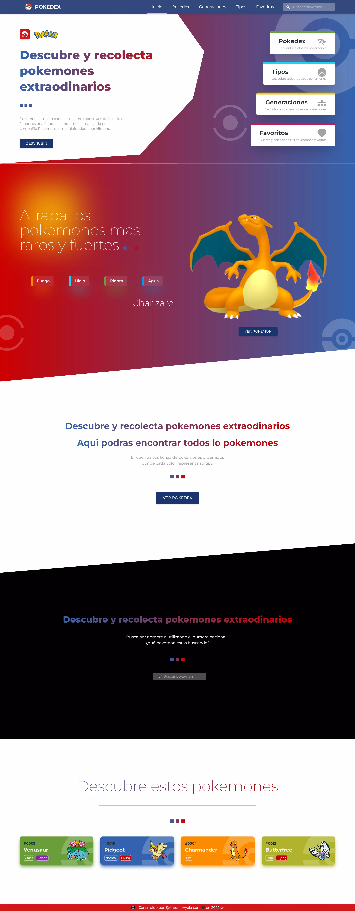

# **POKEDEX**

La típica applicación pokedex que todos hacen, simplemente para practicar next  y tener mi primer acercamiento con tailwind y testing.

Simplemente muestra, busca y guarda tus pokemones ademas de secciones como generaciones y tipos.

## **CAPTURAS**

|   |   |
| ------------- | ------------- |
|    |    |
|    |    |
|    |    |

## **DEMO**

Puede ver el demo de este haciendo click [aquí](https://pokedex-tono2007.vercel.app/).

## **TECNOLOGIAS**

Para el sitio utilice las siguientes tecnologias:

- NextJS
- ReactJS
- Tailwind CSS
- Vercel
- PropTypes

## **USO**

Para usar este proyecto:

- Clonar repositorio: ` git clone https://github.com/Tono2007/pokedex.git`
- Instalar dependencias: `npm install` o` yarn install`
- Ejecutarlo: `npm run dev` o ` yarn run dev`

---

## **PÁGINAS**

## **Testing**
- Test Runner: `npm run test` o ` yarn run test`

Coverage

